# Gameboy Colour Decolouriser
✨Decolourises a Gameboy Color image into a GameBoy image✨ via looking at each tile and mapping the colour values to one of the 4 on a Gameboy.


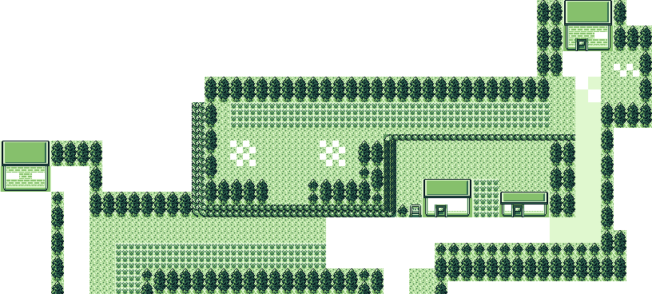

It does this by passing over the image multiple times, making colour adjustments each time.

## Usage
Feel free to grab the latest from [releases](https://github.com/nikouu/GameboyColour-Decolouriser/releases) for your operating system.

### Example

`GameboyColourDecolouriser.exe Decolourise "C:\input.png" "C:\output.png"`

### Synopsis
`GameboyColourDecolouriser [command] [options]`

### Options
`-?, -h, --help`
Show help and usage information

### Commands
- `Decolourise` (or `Decolourize`)
	- Decolourises a Gameboy Color image into a Gameboy image.

### Building
This project targets .NET 7 Preview 7+.

If you want to build and run yourself either:
1. Open the `.sln` in Visual Studio 2022 (or higher)
1. Use `dotnet run Decolourise <input> <output>` in the directory with the `.sln`.

### Publishing

`dotnet publish -c Release -r win-x64`

`dotnet publish -c Release -r osx-x64`

`dotnet publish -c Release -r linux-x64`

[RID reference](https://docs.microsoft.com/en-gb/dotnet/core/rid-catalog)

## Why tho?

In short: I wanted a crisp image when importing into [GB Studio](https://www.gbstudio.dev/).


I wanted to have a set of tiles/sprites in the style of Pokémon Generation 2 (you can check them out in [Pokemon Gen 2 Style Tilemap](https://github.com/nikouu/Pokemon-gen-2-style-tilemap)), so I could play with GB Studio.

Except... When importing my backgrounds into GB Studio I found they were automatically transformed into four Gameboy green colours and I had to "paint" coloured 4 colour palettes onto the tiles myself in the program. Which would be fine except GB Studio does not properly import coloured images. It's obvious with an example where we'll compare the original colour image, the GB Studio version, and the version from this project, GameboyColour Decolouriser:

| Created From       | Resulting Image                          |
| ------------------ | ---------------------------------------- |
| Original Colour    | 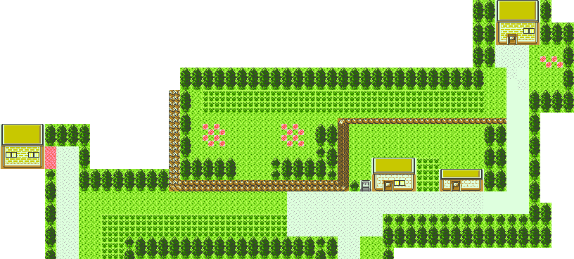   |
| GB Studio          | 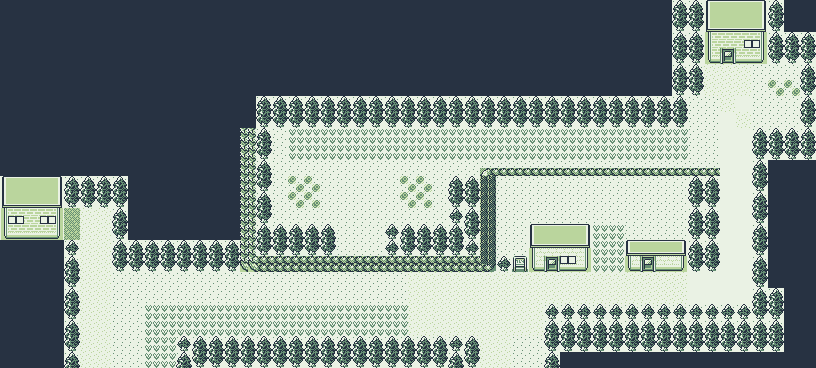     |
| GameboyColour Decolouriser |  |

Ignoring that the actual 4 colour palettes are slightly different (i.e. different shades of green) it still stands that the GB Studio version does not keep the original image fidelity. There is some sort of approximation of colour across the *entire* image and not per tile. This is easy to see if we zoom right into some of the detail:

| Detail     | Original                                    | GB Studio                                 | GameboyColour Decolouriser                            |
| ---------- | ------------------------------------------- | ----------------------------------------- | --------------------------------------------- |
| Building   | 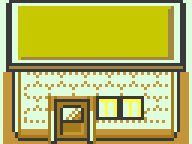  | 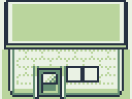  | 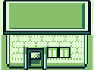  |
| Grass      | 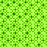     | 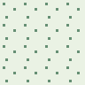     | 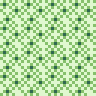     |
| Tall Grass | 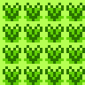 | 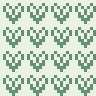 | 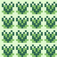 |

See how in GB Studio:
- Building roof shading is lost
- Building window colours are gone
- Grass has been reduced to two colours
- Tall grass has been reduced to two colours

To keep fidelity of the shading is the goal of this project. 

## Technical Notes

### Four colours only
The Gameboy and Gameboy Color both use 8x8px squares as tiles or sprites. Due to the limitation of the hardware each 8x8 tile can only contain a maximum of four colours. In the case of the original Gameboy, it was from any of the four greens and in the case of the Gameboy Colour, it could be any of the colours available, but only a selection of 4 per tile too. There are other limitations when we consider the whole screen and sprites, but that's out of scope here. If you're interested further checkout this: [How Graphics worked on the Nintendo Game Boy by MVG](https://www.youtube.com/watch?v=zQE1K074v3s) for a somewhat technical but still easily consumed video.

This encompasses the technical problem: How do you know what four Gameboy greens to map to true colour Gameboy Colour colours? 

It sounds easy at first because you just obviously map the brightest true colour to the lightest Gameboy shade and keep going that way. But if we just think of brightness, we could have problems like:

- There are different ways to measure brightness which can lead to odd result
- A darker blue on a specific tile might be the darkest for that tile, but it could be the second darkest for another tile. What Gameboy shade applies to this dark blue?

Considering each tile individually and using the constraints of having 4 colours per tile is how the GameboyColour Decolouriser works. It does not take in a whole image to approximate and flatten the colours, like in GB Studio.

### How does it work?
While the program has been through a few iterations, it works by doing several passes over each tile of the image and forming reasoning around what true colour maps to what Gameboy colour (*read: a lot of `Dictionary<K, V>` objects are involved*). These passes are the core workings of the GameboyColour Decolouriser and they are:

#### 1. Recolour Based on Four Colour Tiles
This is the easiest step. Four colour tiles leave no guesswork on how each true colour maps to a Gameboy colour. Just order both true colours and Gameboy colours by brightness and marry them together. 

We can then begin to reason with three colour tiles that are a subset of the four colour tiles. If the three true colours are all the same as any three inside a four colour tile, we can directly map those true colours in the three tile to the Gameboy shades of the four colour.

Then so for two and one colour tiles.

As long as there is a decent amount of four colour tiles, a good chunk of the image can be colourised this way. For example, the image above becomes this much coloured:


The tiles that haven't been resolved contain colours that aren't in any of the four colour tiles. Taking some examples from the image, the gravelly road has a true colour shade of grey that isn't present anywhere else, even though the white part of the road is. Same with the windows, there is a bright yellow that only appears in the windows and in no four colour tiles.

#### 2. Recolour Based on transparent tiles
PNGs are great when working with pixel-based projects, and working with a Gameboy is no different. However while the programs we use might easily undertand transparent pixels, a Gameboy doesn't. Meaning we need to replace the transparent pixels. For this, GameboyColour Decolouriser will convert any transparent pixel into the darkest Gameboy shade. I've found that often my transparent pixels are the "void", or the bits outside of the playable area and since Pokémon does that (check it out next time you're inside a small building) this does the same.

It might be a bit hard to see depending on your dark/light setting, but there is now dark tiles around the outside of the map. 

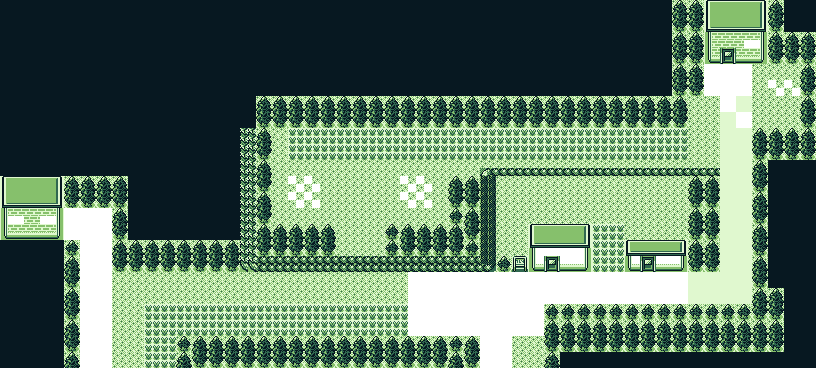

Note that the insides for the paths, windows, and flowers are still transparent - this is because those have yet to be processed.

#### 3. Recolour based on existing tile colours
Previously in step 1, we just focused on four colour tiles and their full subset children.

1. Take a global image dictionary of each true colour and corresponding Gameboy colour
1. Weight each true colour/Gameboy colour based on which true colour has the most Gameboy colours. **Note**: This is the first bit of guesswork and could be a source of problems. Depending on the image, a true colour could map to several Gameboy colours depending on the make up of that true colour tile. See the example earlier about a dark blue colour.
1. When a true colour is found in the dictionary, paint that pixel with the corresponding most-weighted Gameboy colour.

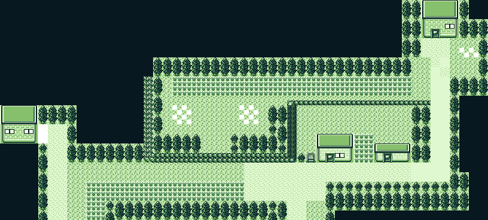

Here we see more of the image filled in. Things like:
- The gravel paths are filled in because the whiter shade already existed in the other paths and the original grey was found on the sign. 
- The buildings and windows (minus the bright yellow) are filled in

#### 4. Recolour based on nearest similar colours
This is the biggest guesswork step. We get to this here when there are unique colours not found in any four colour tiles. For this step the process is:

1. Take the weighted global dictionary of colours and order from brightest to darkest.
2. For each tile with an unmapped pixel colour
	1. Get the brightness of the unmapped pixel
	1. Find the closest brightness of another true colour in the global dictionary
	1. Map the unmapped colour to the Gameboy colour of the closest true colour brightness
	1. Add the new mapping to the global dictionary

While this does have some guesswork, it has proven good enough for my purposes so far.

And that's how we get the final image from Gameboy Color to Gameboy:


### Brightness
It turns out, brightness isn't as easy as I thought. This project uses `System.Drawing.Color` which has a [`.GetBrightness()`](https://docs.microsoft.com/en-us/dotnet/api/system.drawing.color.getbrightness?view=net-6.0) method, except this ordered some colours in a way I didn't expect. For instance in the image below, the colour on the left is considered brighter than the colour on the right.


To get around this I looked for a custom implementation and that's when I realised there are all sorts of ways to try to capture the concept of "brightness". In the end I found an ancient (2008) post called [Calculating the Perceived Brightness of a Color](https://www.nbdtech.com/Blog/archive/2008/04/27/calculating-the-perceived-brightness-of-a-color.aspx) by [Nir Dobovizki](https://twitter.com/NirDobovizki). And used that algorithm - which has suited my use cases so far.

Here's a comparison between the in-built and custom brightness code (bigger number = bigger brighter):

| Colour                                        | .NET `.GetBrightness()` | Custom `.GetBrightness()` |
| --------------------------------------------- | ----------------------- | ---------------------------------- |
| 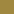 #a08840 | **0.4392157**           | 138                                |
| 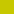 #c7c800 | 0.392156869             | **192**                            |

(Note: It doesn't matter that the number ranges for the calls are different, we're just interested in which, for the same method, is brighter for each colour.)

### Colour libraries
Talking about colour, I realised that if I wanted to make this tool as cross platform as Gb Studio I'll need to do away with `System.Drawing` which only talks to Windows APIs. I needed to decouple the tile decolouring and image code, which was easy enough to abstract out. I actually ended up taking a paired down version of `System.Drawing.Color` and customising it to my needs. 

The next biggest problem was to pick an acceptable cross platform image processing replacement. All I really need is:
1. Get colour values of each pixel
1. Create image by setting colour values of each pixel 

I wanted to have a play with [ImageSharp](https://github.com/SixLabors/ImageSharp) but at the time I wasn't entirely sure how the licence worked. So I went with [SkiaSharp](https://github.com/mono/SkiaSharp).

### Trimming
I love trimming. I've done a whole bunch of work in the preview/experiment for AOT in my repo: [TinyWordle](https://github.com/nikouu/TinyWordle). .NET 7 will have trimming built in and I've introduced it via adding the following to the `.csproj` file:
```xml
<PublishTrimmed>true</PublishTrimmed>
<PublishSingleFile>true</PublishSingleFile>
```

Along with my TinyWordle project, this post "[REAL Single File Publish/Build for `dotnet`](https://www.evanlouie.com/gists/dotnet/publish-single-file)" helped a lot too.

## Previous attempts and issues
- Originally each tile just had it's colours ordered brightest to darkest and using the C# LINQ `.Zip()` call to try to marry them up.
- There was also fiddly mapping of the black and white colours to try to reduce the problem space.
- Ultimately my main problem was tiles of single colours that weren't present elsewhere. 
- Below is the result of an early algorithm idea which due to guesswork by brightnesses lead to weird situations with roofing. 

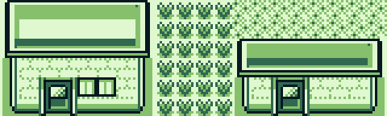

- Turns out you can get a bug when decoding a `FileStream` in SkiaSharp where the image isn't read correctly ([Fix PNG loading issues by updating the zlib to one with fixes #2045](https://github.com/mono/SkiaSharp/pull/2045)): 
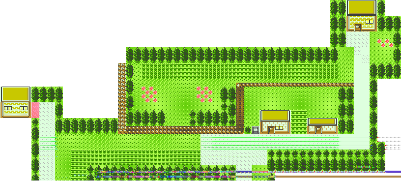
	- The fix at the time was to use [Version 2.88.1 (Preview Build 1)](https://github.com/mono/SkiaSharp/releases/tag/v2.88.1-preview.1) or later.


## Other Notes
- Originally this was in the [Pokemon Gen 2 Style Tilemap](https://github.com/nikouu/Pokemon-gen-2-style-tilemap) and when it grew too big, it came to live here.
- The code is roughly equivalent to mad ravings.
- The working with four colour tiles, then each colour subset tile came to me in a dream.
- It was really fun working within the constraints, especially "there are always only a maximum of four colours". Make reducing the problem space super interesting.
- With the example image I was using, the first iteration of this project took 90 seconds to colourise it. Then sub 4 seconds. *Then* sub 1 second.
